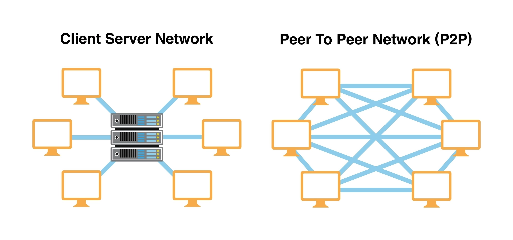

# P2P

## P2P 是啥?

點對點通訊，是通訊的一種技術。

可以讓 多台電腦(container) 互相傳送 資料。中間不需要經過 中央伺服器 來傳話。



## 使用 P2P的目的

在這次的專題中，

要讓 每個 container 都有自己獨立的帳本，但同時 每個 container 的帳本內容又需要相同。

所以 透過 P2P 通訊的方式，

當在 conatiner 1 執行交易的程式時，所有container 會互相聯絡 先確保大家的帳本紀錄都相同，確認都相同後 才會在 container 1 執行交易。

當交易完成後 container 1 的帳本更新時 ，就會去告訴 conatiner 2 和 container 3 更新帳本內容。

## 事前處理

### 安裝套件

初始化資料:

因為每次輸入會是隨機的值 所以應該是 一個 container 建立好初始資料 就複製到其他兩個 container 裡面

使用 make 指令 需要先安裝 (需要自己確認 自己的 ubuntu是否能用 apt 通常是可以)

```bash
sudo apt update
sudo apt install make

#確認有版本就是安裝完成
make --v 
```

Makefile 可以連續執行一連串的指令操作 可以更方便初始化資料

初始化100筆資料到 client1 資料夾 並且複製到 client2 and client3

### 啟動所有 container

```bash
sudo -s
```

```bash
docker compose up -d --build
```

```bash
docker ps -a
```

## DEMO

先進入到專案的資料夾下 (shared_ledger_p2p)

這會初始 20 個 block 的資料，所以之後竄改壞掉想要重新生成 block 可以執行這個

```bash
make init
```

如果遇到 container 已經存在的類似問題 可以執行 (所以正常不需要執行)

```bash
docker rm -f client-1 client-2 client-3
```

再重新跑一次 make init

### 使用 container 開啟 p2p.py 程式

開啟三個終端機視窗，進入到專案的資料夾，分別進入三個容器

```bash
docker exec -it client-1 python3 p2p.py
```

```bash
docker exec -it client-2 python3 p2p.py
```

```bash
docker exec -it client-3 python3 p2p.py
```

### 轉帳 6 次

```bash
transaction A B 100
```

```bash
transaction D R 51
```

```bash
transaction B C 189
```

```bash
transaction C K 156
```

```bash
transaction B D 325
```

```bash
transaction D A 118
```

### 任意二個clients查詢餘額

在某兩個終端機執行:

```bash
checkMoney B
```

```bash
checkMoney A
```

### 任意二個clients查詢交易記錄

在某兩個終端機執行:

```bash
checkLog B
```

```bash
checkLog C
```

### checkChain: 檢查帳本鍊完整性

```bash
checkChain A
```

### checkChain: 竄改任一Client的一個帳本區塊，檢查帳本鍊完整性

先修改 client3 的 某筆 .txt 資料

再跑檢查 記住: 要在終端機 client3 的地方執行才會報出錯誤

```bash
checkChain A
```

### checkAllChains: 檢查所有帳本鍊的完整性

```bash
checkAllChains A
```

### checkAllChains : 竄改任一Client的一個帳本區塊，檢查所有帳本鍊的完整性

先修改 client3 的 某筆 .txt 資料

再跑

```bash
checkAllChains A
```

### 帳本的共識機制

1. 改動 client1 2.txt 某一條 後，在任意 client 終端機 執行

    ```bash
    repairAllChains
    ```

    會修復成功

2. 改動 client1 2.txt 和 client2 6.txt 和 client3 14.txt 後，在任意 client 終端機 執行

    ```bash
    repairAllChains
    ```

    會修復成功

3. 改動 client1 2.txt 和 client2 2.txt (注意: 不能改成一模一樣)，在任意 client 終端機 執行

    ```bash
    repairAllChains
    ```

    會報出錯誤訊息，因為 有兩個 client 的 2.txt 都被竄改，若找不到>50%以上的帳本
