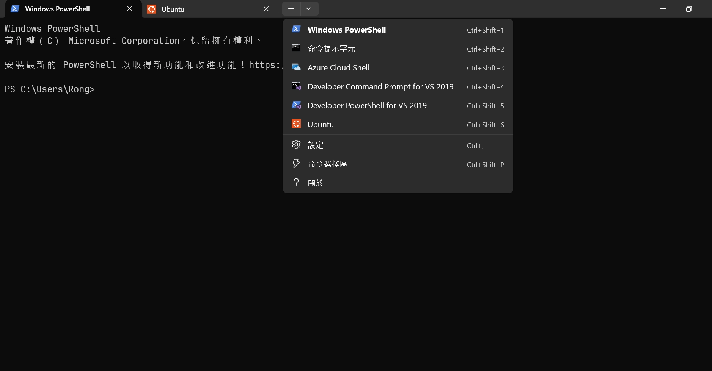
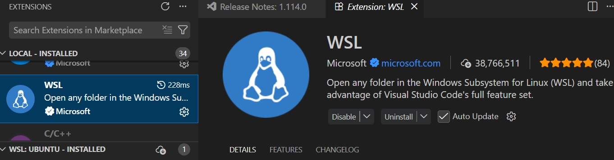
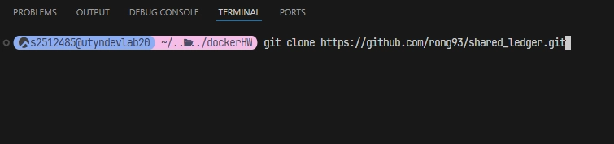
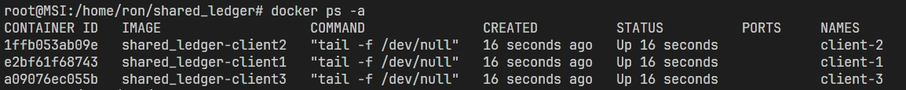
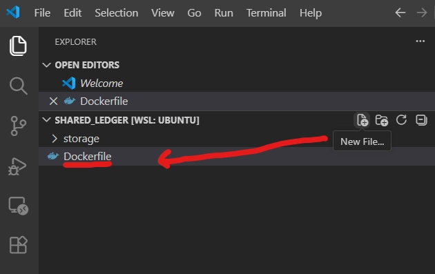

# docker

## ubuntu 安裝

在 windows 上 開啟 終端機(叫 windows powershell)

```bash
wsl --install -d Ubuntu #在windows 的終端機 上面輸入後 會安裝 linux Ubuntu 
```

會需要設定 使用者名稱 和 密碼

安裝完成後 需要重新開啟終端機才會出現 ubuntu



---

## docker 安裝

```bash
#docker 安裝步驟

sudo apt update
sudo apt install docker.io

sudo systemctl start docker 
#啟動 docker 工具，輸入這行之後才可以使用 docker 指令。通常每次開機都需要輸入。

sudo systemctl enable docker 
#這可以讓 電腦開機時(不論是windows or unbuntu 虛擬機 開機) 都會自動 啟動 docker 工具。

sudo docker ps -a
```

```bash
sudo -s #這可以讓之後的指令 不須要 加上 sudo
```

---

## docker compose 安裝

```bash
#🔧 Step 1：安裝必要工具
sudo apt-get update
sudo apt-get install ca-certificates curl gnupg

#🔐 Step 2：加入 Docker 官方 GPG 金鑰
sudo install -m 0755 -d /etc/apt/keyrings

curl -fsSL https://download.docker.com/linux/ubuntu/gpg | \
sudo gpg --dearmor -o /etc/apt/keyrings/docker.gpg

sudo chmod a+r /etc/apt/keyrings/docker.gpg

#📦 Step 3：加入 Docker Repository
echo \
  "deb [arch=$(dpkg --print-architecture) signed-by=/etc/apt/keyrings/docker.gpg] \
  https://download.docker.com/linux/ubuntu \
  $(. /etc/os-release && echo "$VERSION_CODENAME") stable" | \
  sudo tee /etc/apt/sources.list.d/docker.list > /dev/null
  
#🚀 Step 4：更新並安裝 Compose
sudo apt-get update
sudo apt-get install docker-compose-plugin

#✅ 驗證是否安裝成功
docker compose version

#成功會顯示：
Docker Compose version v2.x.x

```

---

## 使用 vscode 連線到 ubuntu

如果要開啟 vscode 而且是 連接到 ubuntu 上面的話 就需要 輸入 code .

但如果不能使用 請先在 vscode 安裝 extension



安裝完 extension 後 在 vscode 輸入 ctrl + shift +P  打上 wsl: connect to wsl 後

就可以在 vscode 打開 ubuntu 的 畫面。

---

## 從 github 下載程式碼

可以先創個資料夾 這裡叫做 dockerHW

```bash
mkdir dockerHW

cd dockerHW
```

程式碼:

<https://github.com/rong93/shared_ledger>

或是用指令下在 會需要 git

```bash
git clone https://github.com/rong93/shared_ledger.git
```



之後進入到 shared_ledger 資料夾

```bash
cd shared_ledger
```

---

## 指令執行 有兩種

1. 進入到 容器 終端機 的 執行指令的方法:

```bash
docker exec -it client-1 sh
```

這會讓你進入到 client-1，就像是進入到 這台電腦的中端機 可以打指令來操作它。

像是

```bash
python3 app_transaction.py Alice Bob 100
```

1. 如果不想進入到容器裡面輸入指令 也可以直接使用

```bash
docker exec -it client-1 python3 app_transaction.py Alice Bob 100
```

會是一樣的效果 但就不需要分段輸入。很像快速進入到 client-1 的終端機 輸入指令 又跳出來。

---

簡單介紹:

dockerfile 規格書 電腦所有內容都在這裡寫好 包括 程式碼

build dockerfile → 會生出 image

docker run image → 才會生出 一個 容器

---

## DEMO

### 容器啟動

啟動多個容器

```bash
docker compose up -d --build
```

```bash
docker ps -a
```

會出現 3 個 容器，如果 STATUS 是 UP，就代表容器啟動成功，就像是 三台 開了機但沒人在用的電腦。



---

### 初始化所有資料

可以更換任何 container (client-1, client-2, client-3)

先確定你的終端機在 /shared_ledger 資料夾中 後，執行:

```bash
docker exec -it client-1 python3 app_init.py
```

會自動生成出 21 個 .txt 檔案。21.txt 沒有交易紀錄 但是會有上一個 block 的 hash 值。

---

### 執行6 次轉帳

```bash
docker exec -it client-1 python3 app_transaction.py A B 100
```

```bash
docker exec -it client-1 python3 app_transaction.py A C 155
```

```bash
docker exec -it client-2 python3 app_transaction.py D E 321
```

```bash
docker exec -it client-2 python3 app_transaction.py D B 81
```

```bash
docker exec -it client-3 python3 app_transaction.py B D 77
```

```bash
docker exec -it client-3 python3 app_transaction.py C E 126
```

---

### 選2 個client 查詢餘額

```bash
docker exec -it client-2 python3 app_checkMoney.py A
```

```bash
docker exec -it client-3 python3 app_checkMoney.py B
```

---

### 任選2 個client 查詢交易紀錄

```bash
docker exec -it client-1 python3 app_checkLog.py C
```

```bash
docker exec -it client-2 python3 app_checkLog.py D
```

---

### 檢查帳本鏈完整性（正常狀態）

```bash
docker exec -it client-1 python3 app_checkChain.py A
```

---

### 人為竄改某一區塊 再次檢查帳本鏈完整性（需能偵測錯誤）

在手動串改 .txt 檔案時 因為某些原因 所以儲存時會遇到權限的問題

所以要先執行:

```bash
sudo chmod -R 777 $(pwd)/storage/
```

(ˋ注意: 每次有 重新初始化(app_init.py) 就需要執行)

之後再跑:

```bash
docker exec -it client-1 python3 app_checkChain.py A
```

---

### 典型的 **Linux 檔案權限問題** 錯誤原因

**`EACCES: permission denied`**：代表你目前的 WSL 使用者（ron）沒有權限對 `/storage/` 資料夾或其中的 `1.txt` 進行**寫入**操作。這通常是因為該資料夾是由 `root` 或 Docker 建立的。

## dockerfile 撰寫流程(用來理解用的) 現在可以從 github 直接下載寫好的 程式碼

  開一個作業資料夾

  ```bash
  mkdir -p shared_ledger #共享帳本黨名
  ```

  進入資料夾後 創建共享的空間 放帳本

  ```bash
  mkdir -p storage
  
  ```

  建立 Dockerfile (這就是檔名)

  

  ```bash
  # 1. 使用官方 Python 輕量版作為基礎
  FROM python:3.9-slim
  
  # 2. 設定容器內的工作目錄，之後你的程式碼會出現在這裡
  WORKDIR /app
  
  # 3. 預先建立好共享帳本的掛載點
  RUN mkdir -p /share
  
  # 4. 因為你還沒寫好執行檔，我們先讓容器啟動後「空轉」
  # 這樣容器才不會因為沒事做就自動關閉（Exited）
  CMD ["tail", "-f", "/dev/null"]
  ```

  撰寫 `docker-compose.yml`

  ```bash
  services:
    # 定義第一台機器
    client1:
      build: .               # 使用目前資料夾的 Dockerfile 建立環境
      container_name: client-1
      volumes:
        - .:/app             # 同步你的 Python 程式碼
        - ./storage:/share   # 【關鍵】這是三台機器共用的「帳本空間」
      tty: true              # 讓容器保持啟動，不要自動關閉
  
    # 定義第二台機器
    client2:
      build: .
      container_name: client-2
      volumes:
        - .:/app
        - ./storage:/share   # 指向同一個實體資料夾
      tty: true
  
    # 定義第三台機器
    client3:
      build: .
      container_name: client-3
      volumes:
        - .:/app
        - ./storage:/share   # 指向同一個實體資料夾
      tty: true
  ```
