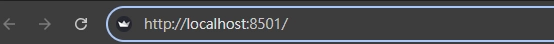

# P2P GUI

徹底清除舊容器與網路

```bash
docker compose down
```

因為 dockerfile 有更動 所以需要重新 bulid image

```bash
docker compose up --build -d
```

如果遇到 衝突 問題 請執行下面 rm 指令 (通常不需要)

```bash
docker rm -f client-1 client-2 client-3
```

初始化資料:

可以和上面一樣 使用 init 來重新產生 20 個 block 資料

```bash
make init
```

開啟三個端端機 分別執行:

```bash
docker exec -it client-1 streamlit run gui.py --server.port 8501 --server.address 0.0.0.0
```

```bash
docker exec -it client-2 streamlit run gui.py --server.port 8502 --server.address 0.0.0.0
```

```bash
docker exec -it client-3 streamlit run gui.py --server.port 8503 --server.address 0.0.0.0
```

在 瀏覽器中開啟三個分頁 分別輸入:



```bash
http://localhost:8501/
```

```bash
http://localhost:8502/
```

```bash
http://localhost:8503/
```

